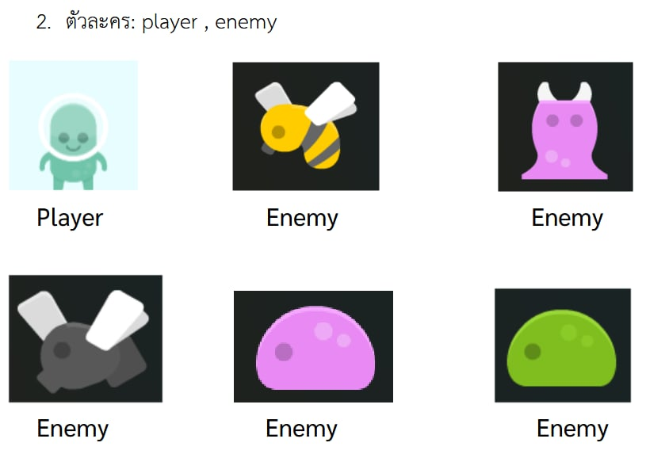
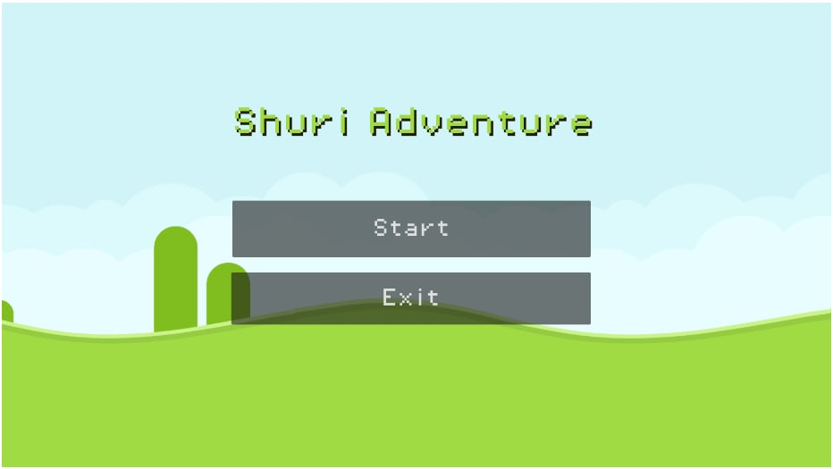
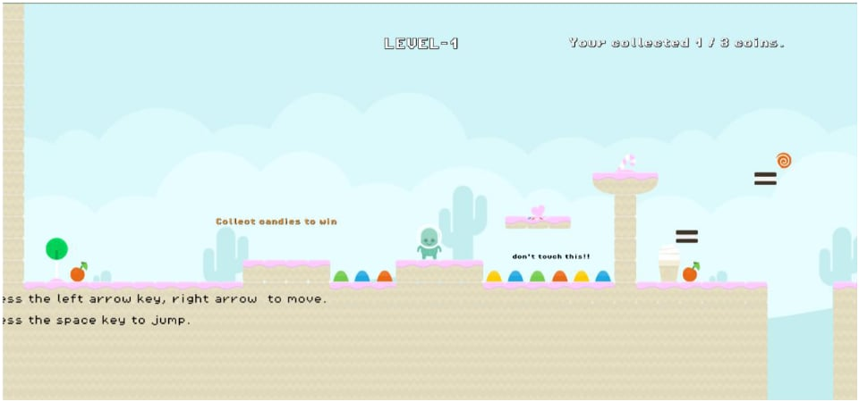
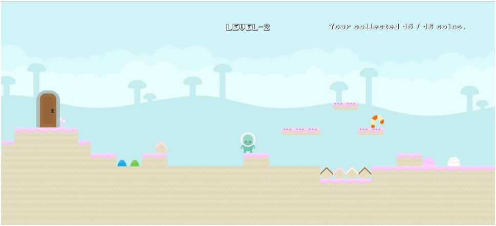
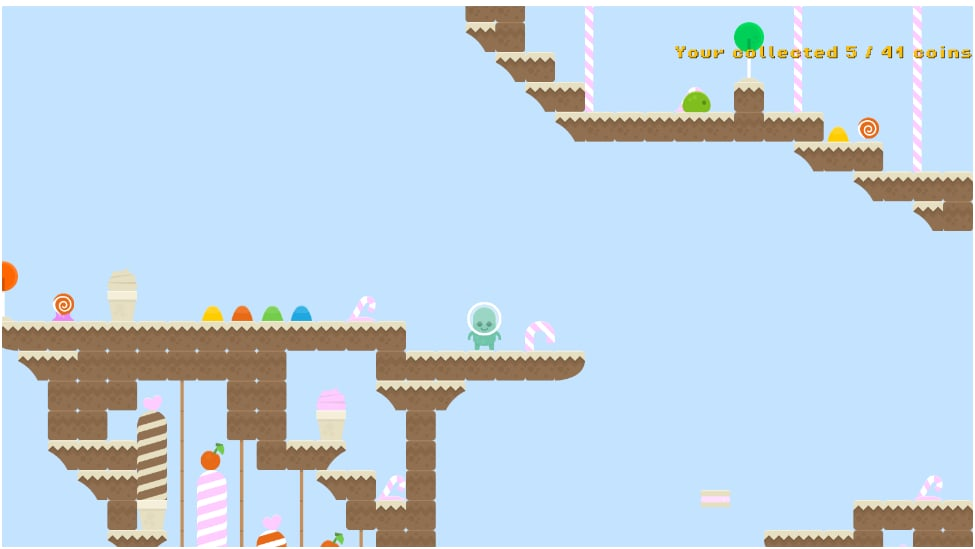
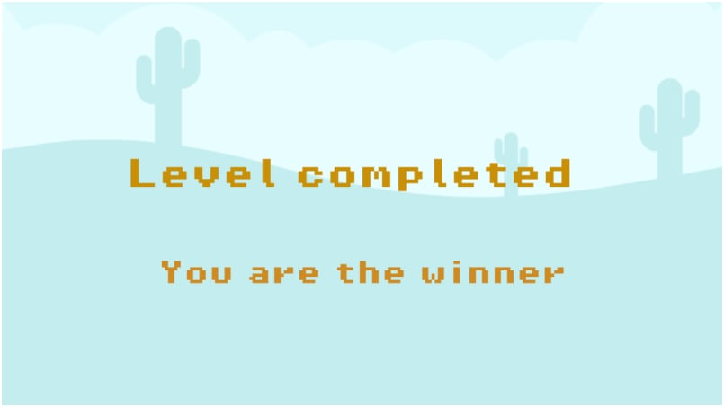
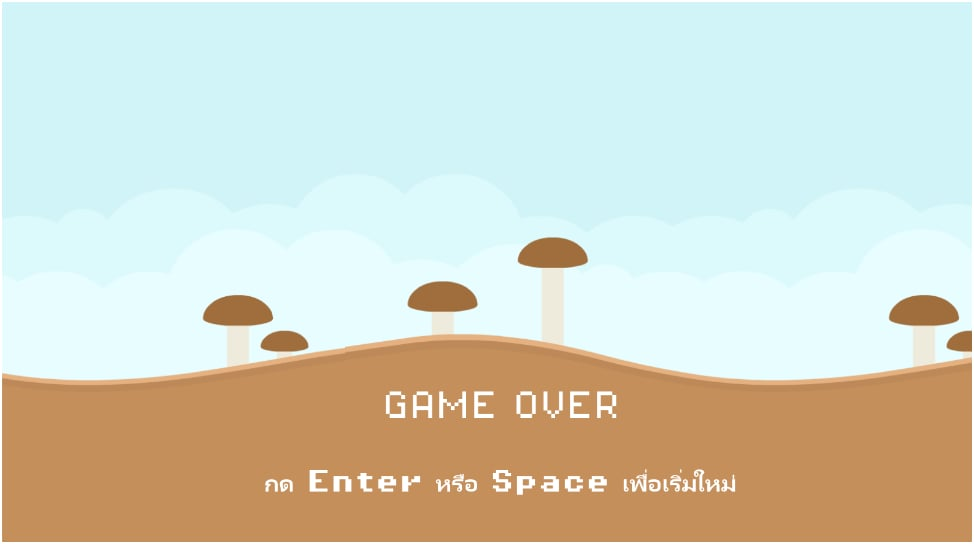

โครงงาน Game 2D

วิชา CP352203-Computer Game Development   ภาคการศึกษาต้น ปีการศึกษา 2568

ชื่อเกม :  shuri adventure

จัดทำโดย : 

653380212-7	นางสาววนิจชรากร เลื่อมใส	CS2
653380191-9	นางสาวจีรวรรณ สิงห์กลิ่น	  	CS2
653380200-4	นายธนพนธ์ ผาศิริ        	CS2
653380220-8	นายอัครพงษ์ ศรีโฉม	    CS2

ธีม หรือ แนวเกม:  
		2D Platformer ,
  		Action

เนื้อเรื่องย่อ :  
	ณ ดาวดวงหนึ่งที่เต็มไปด้วย ขนมหวานและของหวานนับไม่ถ้วน โลกแห่งนี้เคยเป็นดินแดนสวรรค์ของสิ่งมีชีวิตเล็กๆ ที่ชื่อว่า “ชูริ” เอเลี่ยนน่ารักผู้หลงรักขนมหวานมากที่สุด แต่แล้ววันหนึ่ง เอเลี่ยนร้ายจากต่างมิติ ได้บุกเข้ามายึดครอง และเริ่มดูดพลังงานจากขนมหวานไปสร้างกองทัพอันชั่วร้าย
ผู้เล่นจะสวมบทเป็น ชูริ ต้องออกเดินทางผจญภัยผ่านดินแดนขนมหวานต่างๆ เช่น ป่าเจลลี่  ระหว่างทางผู้เล่นต้องก็บ ไอเท็ม เช่น
	🍬 Candy จนเมื่อไปถึงด่านสุดท้ายได้สำเร็จ และรวบรวมแคนดี้ที่หายไปกลับมาได้ครบก็จะกลับดินแดนสวรรค์ที่แสนสงบ
 
ตัวละคร:
		player ,
  		enemy 
- 

รูปแบบการเล่น และ กติกา:
		- ผู้เล่นบังคับตัวละคร
		- ตัวละครสามารถ เดิน / กระโดด / ตกจากที่สูง / ชนสิ่งกีดขวาง / เก็บของ
		- เป้าหมายคือ ผ่านด่าน (Level) โดยไปถึงจุดที่กำหนด หรือ เก็บของให้ครบตามกำหนด
		- ระหว่างทางจะมี
			1. สิ่งกีดขวาง หลุมเหว กับดัก กล่อง
   			2. ไอเท็มที่ต้องเก็บรวบรวมให้ครบ
	  		3. ศัตรู ที่ผู้เล่นต้องคอยหลบ
		- ผู้เล่นมี  ถ้าตกเหว / ชนกับศัตรู -> แพ้
	 กติกา
  		- การควบคุม 
		  1. ปุ่ม a/ลูกศรซ้าย เคลื่อนที่ไปทางซ้าย
		  2. ปุ่ม d/ลูกศรขวา เคลื่อนที่ไปทางขวา
	   	  3. ปุ่ม space/w/ลูกศรขึ้น กระโดด
		- การผ่านด่าน
	 	  1. เดินทางจนถึง ประตู / จุดที่กำหนด
	 	  2. การเก็บไอเท็มให้ครบ
	 	- การแพ้
   		  1. การตกเหว / หลุดออกจากแมพ
	   	  2. การชนกับศัตรู
		- ระบบคะแนน
	 	  1. คะแนนจากการเก็บไอเท็มตามด่านที่นอกเหนือจากไอเท็มเควส
	 	  2. คะแนนจากการผ่านด่าน
	
แนวคิดการออกแบบ
		- แกนหลักของเกม (Core Idea)
 		  1. เกม 2D Platformer, Action ที่เน้นการ กระโดด หลบ เก็บไอเท็ม ในโลกขนมหวาน
 		  2. ความสนุกอยู่ที่การควบคุมตัวละครให้แม่นยำ, อ่านจังหวะสิ่งกีดขวาง/ศัตรู และการสะสม Candy เพื่อปลดล็อกประตูด่าน
		- ธีมและสไตล์ภาพ (Theme & Art Style)
		  1. โลกแฟนตาซี “ขนมหวาน” สดใสน่ารัก (Candy Land)
		  2. โทนสีพาสเทล อมชมพู น้ำเงิน ม่วง ฟ้า
		  3. ตัวละคร ชูริ เป็นเอเลี่ยนน่ารัก ดีไซน์ให้ง่ายต่อการจดจำ
		  4. ศัตรู: สิ่งมีชีวิตจากต่างมิติที่แฝงตัวในรูปแบบขนม
		- เกมเพลย์ (Gameplay Loop)
		  เล่นง่าย → ยากขึ้นเรื่อยๆ แต่แฟร์ (Fair Challenge)
		  1. ผู้เล่นควบคุม “ชูริ” เดิน / กระโดด / เก็บไอเท็ม
		  2. ฝ่าด่านที่เต็มไปด้วยสิ่งกีดขวาง (หลุมเหว, กับดัก, พื้นลื่น, แท่นเลื่อน)
		  3. หลีกเลี่ยงศัตรู (ชน=แพ้)
		  4. เก็บ Candy ให้ครบ เพื่อปลดล็อก ประตูทางออก
		  5. ผ่านด่านแล้วเข้าสู่ Stage ถัดไป
	 	- ฟีเจอร์หลัก (Core Features)
   		  1. การควบคุมลื่นไหล: Jump buffer, Coyote time เพื่อให้กระโดดง่ายและไม่หัวร้อนเกินไป
 		  2. ไอเท็มพิเศษ (เพิ่มสีสันการเล่น) เช่น Candy
		  ระบบคะแนน: ได้จากการเก็บ Candy พิเศษ / ผ่านด่าน / เล่นแบบไม่ตาย
		- โครงสร้างด่าน (Level Design Flow)
 		  1. ด่านแรกๆ: สอนวิธีเดิน-กระโดด เก็บ Candy ง่ายๆ
 		  2. ด่านกลาง: เริ่มมีศัตรูที่เคลื่อนที่, สิ่งกีดขวางที่ต้องจับจังหวะ
 		  3. ด่านท้าย: ซับซ้อนขึ้น มีหลายเส้นทาง ต้องเลือกว่าจะเสี่ยงเพื่อเก็บ Candy ครบหรือไปถึงประตูอย่างปลอดภัย
	 	- เสียงและบรรยากาศ (Audio & Atmosphere)
 		  1. ดนตรีสดใสสไตล์ชิปจูน/คาวาอี้ (แนว Kirby, Candy Crush)
	 	- ความแตกต่าง/เอกลักษณ์ (Unique Selling Point)
 		  1. โลก ขนมหวานแฟนตาซี ที่น่ารัก เล่นแล้วเพลินสายตา
 		  2. การเล่นง่าย เข้าถึงทุกเพศทุกวัย, แต่มีความท้าทายสำหรับสาย Speedrun หรือ Completionist
 		  3. ระบบสะสม Candy
 
กลุ่มเป้าหมาย (ผู้เล่น)
		1. Casual–Midcore อายุ ~9–25 ปี ชอบงานภาพน่ารัก เล่นสั้นๆ ได้ แต่มีความท้าทายพอให้ฝึกฝีมือ
		2. สายสะสม/คอมพลีชันนิสต์ ชอบเก็บแคนดี้ครบ
		3. Speedrunner มือใหม่ อยากจับเวลา ทำโนเดธรันในด่านที่ออกแบบแฟร์ และเรียนรู้ได้

การวิเคราะห์เกม AGE Analysis
	Action
		1. ควบคุมตัวละคร (เดินซ้าย/ขวา/กระโดด)
		2. กระโดดหลบสิ่งกีดขวาง
		3. เก็บ Candy และไอเท็ม
		4. หลีกเลี่ยงศัตรู
		5. เข้าสู่ประตูหรือจุดสิ้นสุดด่าน
  Gameplay
		1. การควบคุมตัวละคร Shuri เพื่อเดิน กระโดด และปีนป่ายผ่านสิ่งกีดขวางในแต่ละด่าน
		2. การต่อสู้/การหลบหลีกศัตรู โดยผู้เล่นต้องจับจังหวะการเคลื่อนไหวเพื่อหลบเลี่ยงหรือกำจัด
		3. การสะสม Candy และไอเท็มพิเศษ เพื่อปลดล็อกประตูด่าน, เพิ่มคะแนน หรือปลดล็อกคอสตูมใหม่
		4. การผ่านสิ่งกีดขวางเชิงแพลตฟอร์ม เช่น หลุมเหว พื้นลื่น แท่นเคลื่อนที่ และกับดักที่ต้องอาศัยการควบคุมที่แม่นยำ
		5. การทำเควสต์ย่อยในแต่ละด่าน เช่น เก็บ Candy จำนวนที่กำหนด
		6. การพัฒนาความท้าทายของด่าน จากด่านง่ายเพื่อฝึกควบคุม → ด่านที่มีศัตรู/สิ่งกีดขวางซับซ้อนมากขึ้น → ด่านท้ายที่ต้องใช้ทักษะทั้งหมด
  Experience
		1. รู้สึกสนุกเพลินจากงานภาพและดนตรีสดใสน่ารัก
		2. ได้รับความท้าทายจากการหลบหลีกและกระโดด
		3. มีกำลังใจในการเล่นซ้ำ เพื่อเก็บ Candy ครบ / ทำสถิติใหม่
		4. รู้สึกถึงการผจญภัยในโลกแฟนตาซีขนมหวาน
		5. เหมาะทั้งผู้เล่น Casual ที่อยากสนุกสั้นๆ และสาย Hardcore ที่อยาก Speedrun

ประโยชน์ของเกม
		1. ฝึกสมาธิและการจดจ่อ ผู้เล่นต้องโฟกัสกับการควบคุมตัวละครและจับจังหวะเพื่อหลบสิ่งกีดขวาง
		2. พัฒนาทักษะการวางแผนและการตัดสินใจ ผู้เล่นต้องเลือกว่าจะเสี่ยงเก็บ Candy ครบเพื่อคะแนนสูง หรือเลือกเส้นทางปลอดภัยเพื่อผ่านด่าน
		3. เสริมทักษะการแก้ปัญหา (Problem-Solving Skills) การเจอกับกับดัก ศัตรู หรือเส้นทางที่ซับซ้อน ช่วยให้ผู้เล่นหาวิธีแก้ปัญหาเฉพาะหน้า
		4. ฝึกการประสานงานระหว่างตาและมือ (Hand–Eye Coordination) การควบคุมการเคลื่อนไหวและการกระโดดแม่นยำ ช่วยพัฒนาการตอบสนองและการกะระยะ
		5. ส่งเสริมความคิดสร้างสรรค์และจินตนาการ ด้วยธีมโลกแฟนตาซี “ขนมหวาน” ทำให้ผู้เล่นรู้สึกเพลิดเพลินและเปิดโลกแห่งจินตนาการ
		6. ช่วยผ่อนคลายและสร้างความบันเทิง ดนตรีสดใส ภาพสีพาสเทล และบรรยากาศน่ารัก ช่วยให้ผู้เล่นคลายเครียดและเล่นได้ทุกเพศทุกวัย
		7. สร้างแรงจูงใจและความพยายาม ระบบคะแนนและการสะสม Candy กระตุ้นให้ผู้เล่นอยากกลับมาเล่นซ้ำเพื่อทำสถิติที่ดีกว่า

หน้าจอ Demo ฉากในเกม 
หน้าเมนู
- 

หน้าเล่นเกม
แสดงหน้าตัวอย่างการเล่น และ คำอธิบาย อย่างน้อย 3 หน้า
- 
- 
- 
		คำอธิบาย วิธีเล่นเกมนี้คือผู้เล่นจะต้องเก็บแคนดี้ที่กระจายอยู่ตามด่านให้ครบทั้งหมดเพื่อที่จะสามารถผ่านไปยังด่านถัดไป ในระหว่างการเล่นจะมีสิ่งกีดขวางและอุปสรรคที่ต้องหลีกเลี่ยง เช่น วัตถุที่ไม่ควรสัมผัส (เช่นข้อความ "don't touch this!") การควบคุมเกมสามารถทำได้โดยใช้ปุ่มลูกศรซ้ายและขวาในการเคลื่อนที่ และปุ่ม Spacebar ในการกระโดด ขณะเล่นให้เก็บแคนดี้และหลีกเลี่ยงอันตรายต่างๆ ในระหว่างทาง
		
Win
- 

Game Over
- 

VDO  (Link ไป clip vdo)

อ้างอิง
	- assets
 	  1. ตัวละคร https://kenney.nl/assets/platformer-pack-redux
	  2. ไอเท็มและtilesต่างๆ https://kenney.nl/assets/platformer-art-candy
